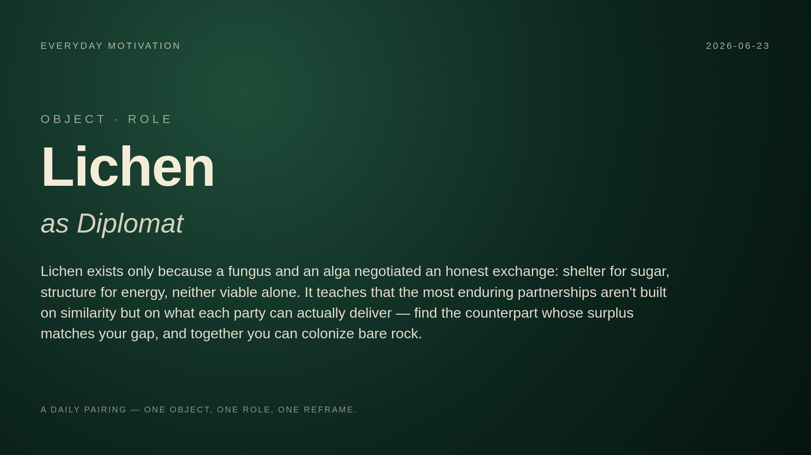

# Concept Log — Used Pairings

This file tracks all object–role combinations to prevent repetition.

| Date | Object | Role | File |
|------|--------|------|------|
| 2026-06-23 | Mantis Shrimp | Art Museum Curator | `2026-06-23_mantis-shrimp-curator.md` |

## Pairings

- Lichen: Diplomat — Lichen exists only because a fungus and an alga negotiated an honest exchange: shelter for sugar, structure for energy, neither viable alone. It teaches that the most enduring partnerships aren't built on similarity but on what each party can actually deliver — find the counterpart whose surplus matches your gap, and together you can colonize bare rock. 
